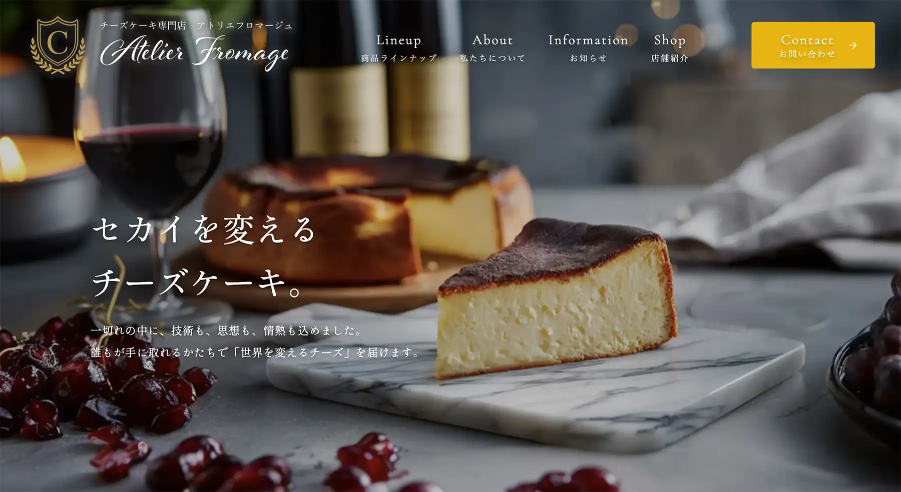

# ①課題名

チーズケーキ専門店 アトリエフロマージュ

## ②課題内容（どんな作品か）

チーズアカデミーの卒業生が立ち上げた 
「世界を変えるチーズケーキ」の紹介LP

## ③アプリのデプロイURL

https://wild-river.github.io/kadai00_atlier-fromage/

## ④アプリのログイン用IDまたはPassword（ある場合）

- ID: 今回なし
- PW: 今回なし

## ⑤工夫した点・こだわった点

- ChatGPTとアイディアを相談しながら内容や構成を考えました。
- 自分でFigmaでデザインを作成した上で、コードの実装を進めました。
- ビジュアル素材には生成AI（Midjourney）を活用しています。
- CSSはすべてTailwind CSSで書くことにチャレンジしました。
- 商品ラインナップでクリック時に表示されるウィンドウのON/OFFもTailwindCSSで実装しました。

## ⑥難しかった点・次回トライしたいこと（又は機能）

- Tailwind CLIの環境構築にとても苦労しました。
- 動画教材と現在の最新バージョン（v4系）に差異があるようで、公式ドキュメントを参照しながら進めました。

## ⑦フリー項目（感想、シェアしたいこと等なんでも）

Tailwind CSSを活用することで、今後のWebアプリ開発においても 
開発スピードの向上が期待できると感じました。
